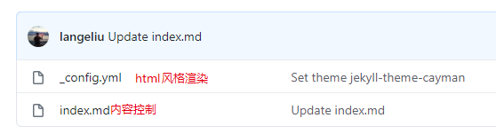
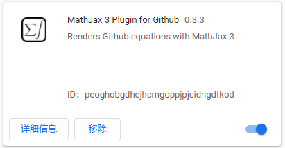
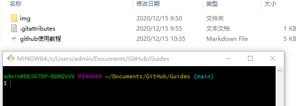

# Github使用教程

## 1. 网页版与客户端

[网页版github](https://github.com/)可以创建和设置账户，desktop主要是管理本地文件：直接在本地修改相应仓库路径下的文件后通过github desktop同步到网页版。[客户端下载地址](https://desktop.github.com/)，需要挂VPN，下载完成后通过网页版授权登录即可。

账户创建、设置和登录以及查看文件在网页版更方便，而修改文件在本地更方便，因此，客户端主要是为了将本地修改后的文件同步到网页版。

主语仓库、分支、上传文件、下载文件可以参考[git教程](https://www.runoob.com/git/git-tutorial.html)、[github教程](https://www.jianshu.com/p/296d22275cdd)。

## 2. 部署静态网页

github允许生成一个个人主页，类似于一个静态的网页，其实就是将一个markdown文件渲染成为网页(html)，以静态网页的形式呈现给访问者，比如[我的主页](https://langeliu.github.io/)。创建方式如下：

1. 新建一个github，命名为`username.github.io`，公开，不自动创建readme.md文件。

2. 在settings选择一个theme，可以看到创建了两个文件，如下图所示，yml文件为网页风格渲染文件，由选定的theme决定，不用修改。md文件为内容，采用markdown编写，可以自行修改。

    
   
   创建完成后可以通过`username.github.io`打开页面。
   
3. 在index.md文件中修改想要在静态页面呈现的内容，同时支持html语言。此外，可以自己使用html创建页面然后显示出来。

## 3. 页面无法显示图片和公式问题

github网页.md文件有时候存在图片加载慢或者无法显示，以及不支持latex公式的问题，前者跟DNS、host设置等有关，具体参考[github网页显示图片失败原因](https://blog.csdn.net/qq_38232598/article/details/91346392)，后者则是github本身就不支持公式，需要安装浏览器插件。

**（1）图片加载慢或显示失败**

1. 修改hosts文件，windows系统在`C:\Windows\System32\drivers\etc\hosts`目录下，打开后添加以内容

   ```shell
   # GitHub Start 
   140.82.113.3      github.com
   140.82.114.20     gist.github.com
   
   151.101.184.133    assets-cdn.github.com
   151.101.184.133    raw.githubusercontent.com
   151.101.184.133    gist.githubusercontent.com
   151.101.184.133    cloud.githubusercontent.com
   151.101.184.133    camo.githubusercontent.com
   151.101.184.133    avatars0.githubusercontent.com
   199.232.68.133     avatars0.githubusercontent.com
   199.232.28.133     avatars1.githubusercontent.com
   151.101.184.133    avatars1.githubusercontent.com
   151.101.184.133    avatars2.githubusercontent.com
   199.232.28.133     avatars2.githubusercontent.com
   151.101.184.133    avatars3.githubusercontent.com
   199.232.68.133     avatars3.githubusercontent.com
   151.101.184.133    avatars4.githubusercontent.com
   199.232.68.133     avatars4.githubusercontent.com
   151.101.184.133    avatars5.githubusercontent.com
   199.232.68.133     avatars5.githubusercontent.com
   151.101.184.133    avatars6.githubusercontent.com
   199.232.68.133     avatars6.githubusercontent.com
   151.101.184.133    avatars7.githubusercontent.com
   199.232.68.133     avatars7.githubusercontent.com
   151.101.184.133    avatars8.githubusercontent.com
   199.232.68.133     avatars8.githubusercontent.com
   
   # GitHub End
   ```

   如果提醒无权限甚至添加了之后无法保存，可以以管理员身份启动notepad++修改（我的方法），或者先保存到其他地方再移动回去（我没试过）。

2. 刷新DNS

   win+R输入cmd，启动命令行，输入`ipconfig /flushdns`回车即可

**（2）公式无法显示**

谷歌浏览器插件搜索MathJax 3 Plugin for Github，安装即可。



支持的公式类型比typora等专业markdown编辑软件少，因此尽量使用简单的、命令简洁的公式。

**（3）git命令上传下载**

修改完成后：

1. 在当前仓库本地文件夹下，右键启动`git bash here`

   

2. 检查文件是否有修改，使用命令`git status`,如果有文件被修改就可以开始上传，如果有文件，可以加一句`git add *`.类似于客户端，先添加评论，使用命令`git commit -a`，启用vim编辑器，或者`git commit -m 'commit content' `直接添加。

3. 最后使用`git push`上传。

    